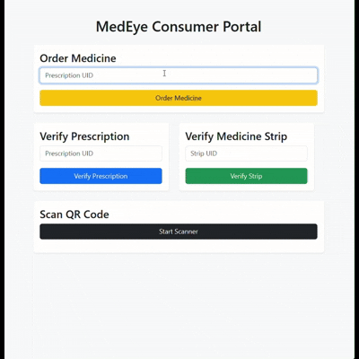
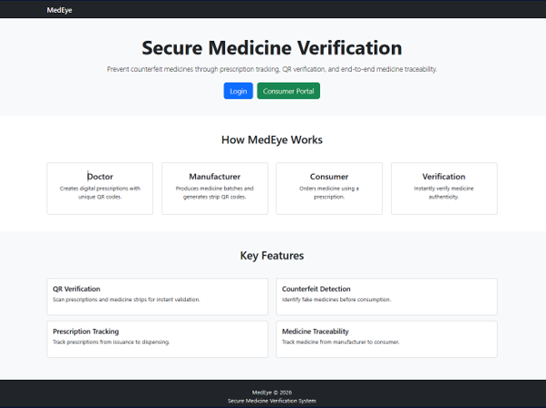
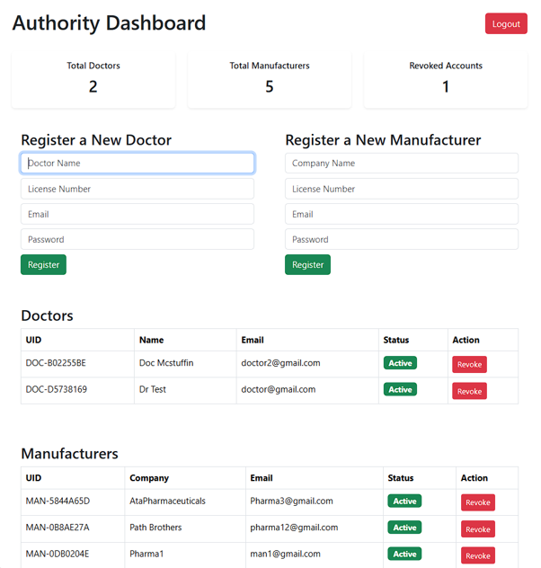
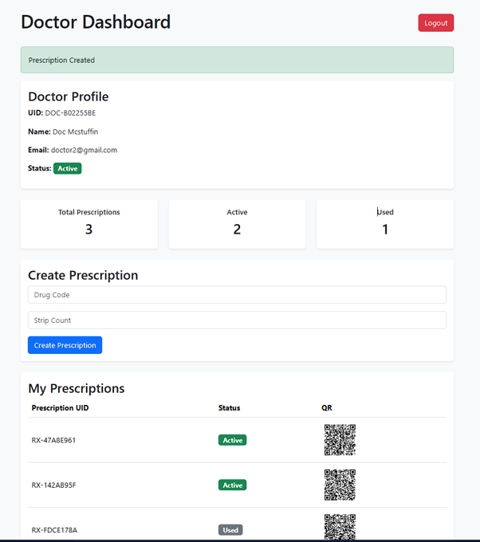
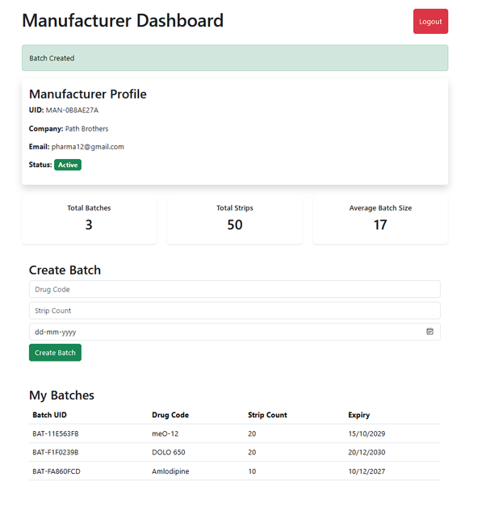
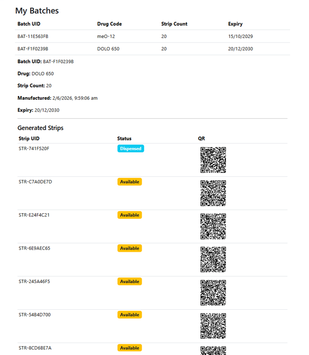
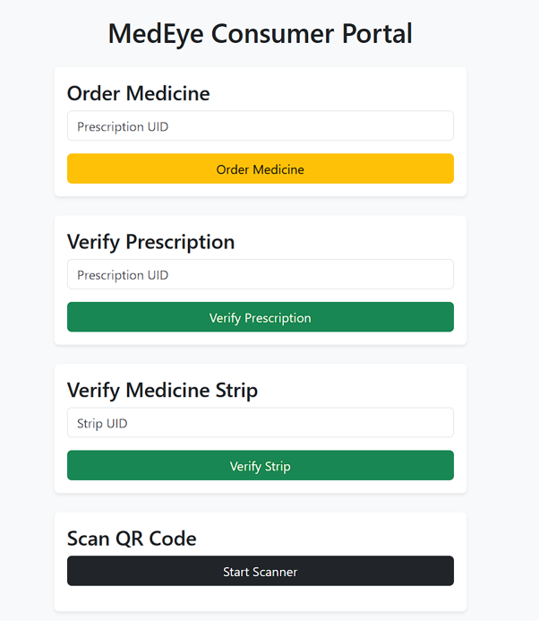
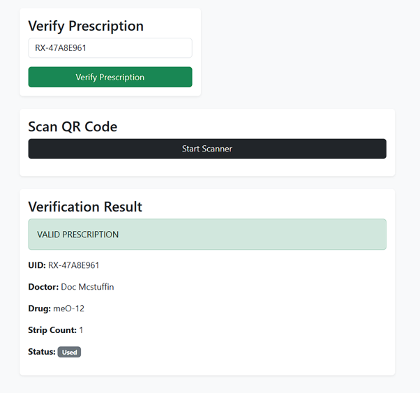
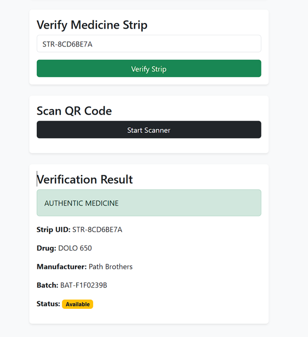

# MedEye

## Secure Prescription Tracking & Medicine Verification System

MedEye is a full-stack healthcare traceability platform designed to combat counterfeit medicines through prescription tracking, medicine verification, QR-based authentication, and supply chain transparency.

The platform establishes a secure chain of trust between healthcare authorities, doctors, manufacturers, and consumers, ensuring that medicines can be tracked and verified throughout their lifecycle—from prescription issuance to final dispensing and authenticity validation.

---

## Demo

### Complete Workflow Demonstration



The demonstration showcases the consumer verification and dispensing workflow within MedEye.:

1. Prescription verification by the consumer
2. Medicine ordering using a valid prescription
3. Automatic strip allocation
4. Dispensing process
5. Medicine authenticity verification

---

## Problem Statement

Counterfeit medicines remain a major global healthcare challenge, causing financial losses, treatment failures, and serious risks to patient safety.

Traditional pharmaceutical distribution systems often lack:

* Prescription traceability
* Supply chain transparency
* Consumer verification mechanisms
* Real-time authenticity validation
* End-to-end medicine tracking

As a result, consumers may unknowingly purchase or consume counterfeit medicines.

MedEye addresses these challenges by providing a secure digital verification ecosystem capable of tracking medicines from prescription generation to final consumer verification.

---

## Key Features

### Prescription Lifecycle Management

* Digital prescription generation
* Unique prescription identifiers
* QR code generation
* Prescription status tracking
* Dispense tracking
* Prescription validation

### Medicine Traceability

* Batch generation and management
* Strip-level identification
* Unique strip QR codes
* Manufacturer attribution
* Dispense tracking
* Supply chain visibility

### Consumer Verification

* Prescription verification
* Medicine strip verification
* QR scanning support
* Authenticity validation
* Counterfeit detection

### Administrative Controls

* Doctor onboarding
* Manufacturer onboarding
* Account management
* Account revocation
* Platform governance

### Security Features

* JWT Authentication
* Password Hashing (bcrypt)
* Role-Based Access Control (RBAC)
* Secure API Design
* Transaction-safe Dispensing Operations
* Unique Entity Identification

---

## System Architecture

```text
Authority
│
├── Registers Doctors
├── Registers Manufacturers
│
▼

Doctor
│
├── Creates Prescription
├── Generates Prescription QR
│
▼

Consumer
│
├── Orders Medicine
│
▼

Dispense Process

▲
│

Manufacturer
│
├── Creates Medicine Batches
├── Generates Medicine Strips
├── Generates Strip QR Codes
│
▼

Consumer
│
├── Verifies Prescription
├── Verifies Medicine Strip
└── Scans QR Codes
```

---

## User Roles

### Authority

The Authority acts as the governing body of the ecosystem.

Capabilities:

* Register doctors
* Register manufacturers
* View registered entities
* Revoke accounts
* Manage platform access

---

### Doctor

Doctors issue digital prescriptions that become verifiable records within the system.

Capabilities:

* Login securely
* Create prescriptions
* Generate QR codes
* Track prescription status
* View dispense information

---

### Manufacturer

Manufacturers generate medicine batches and maintain production traceability.

Capabilities:

* Create medicine batches
* Generate medicine strips
* Produce strip-level QR codes
* Track inventory
* Monitor dispense status

---

### Consumer

Consumers can independently verify medicines before consumption.

Capabilities:

* Order medicine
* Verify prescriptions
* Verify medicine strips
* Scan QR codes
* Validate authenticity

---

## Screenshots

### Landing Page



The public entry point of MedEye providing an overview of the platform, verification workflow, and user ecosystem.

---

### Authority Dashboard



The Authority Dashboard serves as the administrative control center of the platform.

Features:

* Doctor registration
* Manufacturer registration
* Account management
* Status monitoring
* Account revocation
* Administrative statistics

---

### Doctor Dashboard



The Doctor Dashboard enables healthcare professionals to issue and manage digital prescriptions.

Features:

* Prescription creation
* QR generation
* Prescription tracking
* Dispense visibility
* Prescription analytics
* Status monitoring

---

### Manufacturer Dashboard



The Manufacturer Dashboard provides visibility into medicine production and inventory management.

Features:

* Batch creation
* Inventory generation
* Production statistics
* Batch management
* Manufacturer profile management

---

### Batch Traceability View



Expanded batch view demonstrating strip-level medicine traceability.

Features:

* Generated strip inventory
* Individual strip identifiers
* Strip QR codes
* Dispense status tracking
* Batch-to-strip relationship visualization

This view demonstrates MedEye's ability to trace medicine units beyond the batch level, providing granular transparency throughout the pharmaceutical supply chain.

---

### Consumer Portal



The Consumer Portal provides direct access to medicine ordering and authenticity verification.

Features:

* Medicine ordering
* Prescription verification
* Medicine strip verification
* QR scanning interface

---

### Prescription Verification



Real-time prescription authenticity validation.

Verification includes:

* Prescription identity
* Doctor information
* Drug information
* Prescription status
* Prescription legitimacy

---

### Medicine Verification



Medicine strip authentication and provenance verification.

Verification includes:

* Strip identity
* Manufacturer information
* Batch information
* Dispense status
* Authenticity validation

This capability enables consumers to verify medicines before consumption and helps combat counterfeit pharmaceutical products.

---

## Technology Stack

### Backend

* Node.js
* Express.js
* TypeScript
* PostgreSQL

### Frontend

* EJS
* Bootstrap 5
* Vanilla JavaScript

### Security

* JWT Authentication
* bcrypt Password Hashing
* RBAC Authorization

### Infrastructure

* Docker
* Docker Compose

### Additional Libraries

* QR Code Generation
* HTML5 QR Scanner
* UUID Generation

---

## Database Design

Core entities:

* Authorities
* Doctors
* Manufacturers
* Prescriptions
* Medicine Batches
* Medicine Strips
* Dispenses

The relationships between these entities enable complete prescription and medicine traceability throughout the healthcare supply chain.

---

## API Modules

### Authentication

```text
/auth
```

### Authority Management

```text
/authority
```

### Doctor Operations

```text
/doctors
```

### Manufacturer Operations

```text
/manufacturers
```

### Verification Services

```text
/verify
```

### Ordering System

```text
/order
```

---

## Installation

### Clone Repository

```bash
git clone <repository-url>
cd medeye
```

### Install Dependencies

```bash
npm install
```

### Start PostgreSQL

```bash
docker-compose up -d
```

### Configure Environment Variables

Create a `.env` file:

```env
PORT=3000
DATABASE_URL=your_database_url
JWT_SECRET=your_secret_key
```

### Initialize Database

```bash
npm run init-db
```

### Start Backend

```bash
npm run dev
```

### Start Frontend

```bash
node frontend/server.js
```

---

## Project Highlights

This project demonstrates practical experience with:

* Full-Stack Development
* REST API Design
* Authentication & Authorization
* Database Design
* Transaction Management
* QR-Based Verification Systems
* Healthcare Technology Workflows
* Supply Chain Traceability
* Role-Based Access Control
* Secure Application Architecture

---

## Future Enhancements

Potential future improvements include:

* React / Next.js Frontend
* Mobile Application
* Advanced Analytics Dashboard
* Cloud Deployment
* Audit Logging
* Multi-Authority Support
* QR Signature Verification
* Real-Time Notifications
* CI/CD Pipelines
* Blockchain-Based Traceability

---

## License

This project is intended for educational, research, and portfolio purposes.
